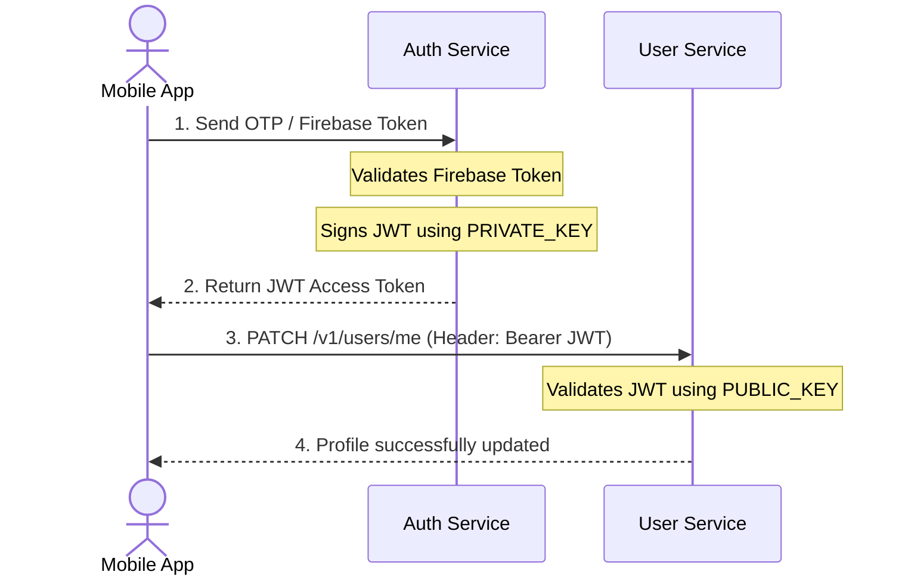
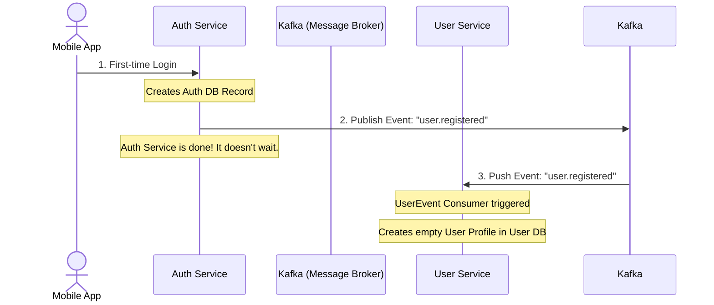

# TripParty Backend System Architecture

This document provides a high-level overview of the microservices architecture used in the TripParty backend, specifically focusing on the relationship and flow between the **Auth Service** and the **User Service**.

## High-Level Architecture

The TripParty backend is built using a **Microservices Architecture**. This means the application is divided into small, independent services that communicate with each other over the network, rather than being one massive monolithic application.

### Why Microservices?
- **Isolation**: If the User Service crashes, users can still log in and generate tokens via the Auth Service.
- **Scalability**: If the Auth Service receives a massive spike in logins, we can scale it up independently of the User Service.
- **Security**: The User Service does not need to know the highly sensitive database credentials or private cryptographic keys that the Auth Service uses.

---

## 1. The Services

### Auth Service (`/services/auth`)
- **Role**: The "Bouncer". Handles identity verification.
- **Responsibilities**:
  - Verifies phone numbers and OTPs via Firebase.
  - Handles Google OAuth logins.
  - Generates secure RS256 JSON Web Tokens (JWTs) using a Private RSA Key.
  - Maintains strict rate-limiting via Redis to prevent brute-force attacks.

### User Service (`/services/user`)
- **Role**: The "Bartender". Handles the application's core user data.
- **Responsibilities**:
  - Manages public profiles (Bio, Display Name, Avatars).
  - Handles the social graph (Followers, Following, Blocking).
  - Tracks traveler ranks, XP, and travel statistics.
  - Does **not** verify passwords or OTPs. It trusts the JWT tokens provided by the Auth Service.

---

## 2. Cross-Service Communication flows

Because services do not share the same database, they must communicate with each other to keep data in sync.

### Flow A: Authentication & Verification (Asymmetric Cryptography)

How does the User Service know a user is logged in without talking to the Auth Service?

**Key Takeaway**: 
The Auth Service holds the `PRIVATE_KEY` to *create* the wristband (JWT). The User Service holds the `PUBLIC_KEY` in its `auth.middleware.ts` to mathematically *verify* the wristband. They never need to talk to each other directly for this!

### Flow B: Event-Driven Sync (Kafka)

What happens when a brand new user logs in for the first time? How does the User Service know to create a blank profile for them?

**Key Takeaway**:
This is called an **Event-Driven Architecture**. The Auth Service simply broadcasts an event to Kafka and moves on. The User Service listens to Kafka in the background (`userEvent.consumer.ts`). If the User Service is temporarily down, Kafka holds onto the message until it comes back online, ensuring no profiles are ever lost.
